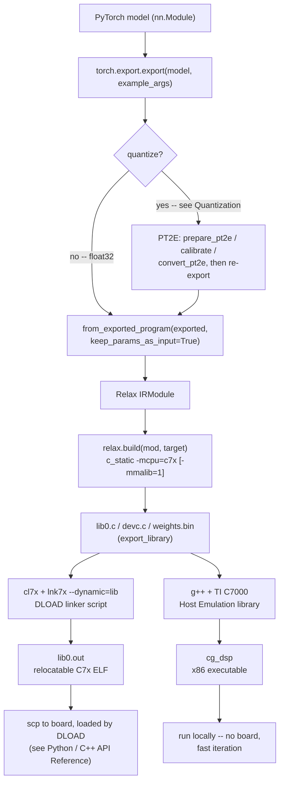

# Compilation

## Overview

Compilation turns a PyTorch model -- quantized or plain float32 -- into
a runnable artifact: a `lib0.out` DLOAD module for on-board deployment
(`c7x_dload`), or a native executable for host emulation (`c7x_host`,
no board needed). Four stages: PyTorch's own export, TVM's Relax import
of that exported program into an `IRModule`, and TVM's `c_static`
backend compiling that `IRModule` to C source + a weights file (the
public TVM APIs), then the TI toolchain building that C source into the
final artifact (a native build -- not a TVM API, and the mechanics
differ by mode):



See [Quantization](quantization.md) for the PT2E branch, and
[Python / C++ API Reference](python-api.md) for what happens once
`lib0.out` is on the board.

## The Public TVM APIs

### From PyTorch to Relax

Every model, quantized or not, enters TVM the same way:

```python
from tvm.relax.frontend.torch import from_exported_program

exported = torch.export.export(model, example_args)
mod = from_exported_program(exported, keep_params_as_input=True)
```

For a quantized model, `model` here is PT2E's `convert_pt2e` output and
`exported` comes from a second, post-quantization `torch.export.export`
call -- see [Quantization](quantization.md) for the `prepare_pt2e` /
calibrate / `convert_pt2e` sequence that produces it. Either way, `mod`
is a plain Relax `IRModule` from here on -- the input to everything
below, whether it came from a float or quantized model.

### Target string

```python
target = tvm.target.Target("c_static -mcpu=c7x -mmalib=1")
```

`mcpu` selects the DSP family (`c66x` or `c7x`); everything else is a
target attribute that tunes or extends what codegen does for that CPU.

### Target Attributes Reference

| Attribute | Type | Default | Description |
|-----------|------|---------|--------------|
| `mcpu` | String | (unset) | Target CPU: `c66x`, `c7x` (also accepts `arm`-prefixed, `generic`) |
| `use-cpp-api` | Bool | `true` | Direct C++ calls for VM operations instead of FFI dispatch (~12% faster on DSP). **Required** (not just faster) for `c7x_dload` -- DLOAD needs the C++-API codegen path. |
| `profile-layers` | Bool | `false` | Per-layer DSP cycle profiling, printed via the shared-memory trace buffer (see [Deploying Firmware](deploying-firmware.md)) |
| `mmalib` | Bool | `false` | Route eligible conv2d/matmul ops to MMALIB kernels (requires `mcpu=c7x`; see [Quantization](quantization.md)) |
| `tidl-kernels` | Bool | `true` | Firmware has TIDL-backed native kernels available (e.g. `c7x_int8_max_pool_tidl`). **Must be `0`** (`-tidl-kernels=0`) for BeagleY-AI, whose firmware links `--tidl OFF` -- otherwise codegen emits a call to a symbol the firmware doesn't export, which fails only at DLOAD load time on the board, not at compile time. |
| `tidl-runtime` | Bool | `false` | Emit `tidl_bridge_init_all()` in `cg_main_dsp`; set automatically when TIDL subgraphs are present. Not used by either example in this repo -- both offload via MMALIB directly, not TIDL subgraphs. |
| `skip-runtime-checks` | Bool | `true` | Skip tensor shape/type validation |
| `debug-alloc` | Bool | `false` | Enable diagnostic allocation tracing |

### Picking the pipeline

```python
from tvm.relax.backend.cpu_generic.pipeline import get_default_pipeline

relax_pipeline = get_default_pipeline(target)
```

`get_default_pipeline` selects the right sequence of Relax passes for
`target` -- MMALIB QDQ fusion, layout conversion, DMA tiling, and so on,
depending on the target attributes above. Treat it as a black box here:
see [MMALIB Integration](../contributor-guide/backend/mmalib-integration.md)
and the `tvm-relax-c7x:relax-passes` skill for what runs inside it. You
rarely call this yourself -- `compile_for_dsp` (below) already does.

### Building

```python
target = tvm.target.Target(target_string)
with target:
    with tvm.transform.PassContext(opt_level=3):
        executable = relax.build(
            mod,
            target,
            exec_mode="compiled",
            system_lib=True,
            relax_pipeline=relax_pipeline,
            tir_pipeline=None,
        )
```

- `exec_mode="compiled"` -- compiles the VM's own control flow to native
  code instead of interpreting bytecode (the default `"bytecode"` mode);
  required for `c_static`'s fully-static, no-interpreter-loop model.
- `system_lib=True` -- packs the result as a statically-linked system
  library that auto-registers its functions, instead of a dynamically
  loaded module. Matches an embedded target with no shared-library
  loader.
- `relax_pipeline` -- the pass sequence from *Picking the pipeline*
  above.
- `tir_pipeline=None` -- use the target's own registered TIR pipeline
  (e.g. `ScheduleC7xDMATiling`) instead of a generic default.

### Exporting

```python
executable.export_library(str(tar_path), target=target)
```

Produces a Model Library Format tarball; extract it to get `lib0.c`,
`devc.c`, and `weights.bin` -- the inputs to the native build stage
below.

## From Generated C to a Runnable Artifact

`lib0.c` + `weights.bin` are not runnable yet. What happens next depends
on the mode:

- **`c7x_dload`**: the TI CGT C7000 compiler and a DLOAD linker script
  (`--dynamic=lib`) build `lib0.c` into a relocatable C7x ELF
  (`lib0.out`), with `weights.bin` embedded as a `.rodata.weights`
  section. See [C Static Backend -- Building a DLOAD
  Module](../contributor-guide/backend/c-static.md#building-a-dload-module)
  for the two-stage link and the full end-to-end diagram.
- **`c7x_host`**: system `g++`, plus TI's C7000 Host Emulation library
  (emulates C7x vector types/intrinsics on x86), build `lib0.c` into a
  native `cg_dsp` executable -- no DLOAD, no board. Requires
  `TI_CGT_C7000_PATH`. This is the fast, no-hardware iteration path; see
  [DSP C++ Harness](../contributor-guide/testing/dsp-cpp-harness.md) for
  the general host-emulation CMake pattern this builds on.

Neither step is a TVM API call -- both are native builds this project's
test harness automates (next section).

## Reusing the Test Harness's Compilation Helpers

`tests/ti-dsp-runtime/dsp-cpp/dsp_utils.py` wraps everything above in
three functions. Reuse them rather than re-implementing the sequence:
they're exercised by the full DSP pytest suite across every board/mode
combination, so they already handle edge cases that are easy to miss
writing it from scratch -- BeagleY-AI's `-tidl-kernels=0`, the DLOAD
two-stage link, weights embedding.

- **`get_target_string(dsp_mode, profile_layers=False, use_cpp_api=False)`**
  -- builds the target string for a given mode (`"c7x_host"` or
  `"c7x_dload"`), including the `c7x_dload`-only `-tidl-kernels=0` for
  BeagleY-AI.
- **`compile_for_dsp(mod, target_string, output_dir)`** -- runs
  *Picking the pipeline* through *Exporting* above; returns the
  directory containing `lib0.c` / `weights.bin`.
- **`build_dsp_dynmod(generated_dir, build_dir, weights_file=...)`**
  (`c7x_dload`) -- runs the DLOAD build; returns the path to `lib0.out`.
- **`build_dsp_c7x_host(generated_dir, build_dir=...)`** (`c7x_host`) --
  runs the host-emulation build; returns the path to the `cg_dsp`
  executable. Pair with `run_dsp_host(executable)` to actually run it.

## Worked Examples

### c7x_dload: What the two examples do

Both `run_yolo26_detection.py` and `run_resnet18_classification.py`
target `c7x_dload` and MMALIB, and the sequence is exactly the three
helpers above:

```python
target_string = get_target_string("c7x_dload", use_cpp_api=True) + " -mmalib=1"
generated_dir = compile_for_dsp(mod, target_string=target_string, output_dir=build_dir)

weights_path = generated_dir / "weights.bin"
module_path = build_dsp_dynmod(
    generated_dir=generated_dir,
    build_dir=build_dir / "build",
    weights_file=weights_path if weights_path.exists() else None,
)
```

`use_cpp_api=True` is not a style choice here -- c7x_dload requires the
C++-API codegen path. The one real difference between the two scripts:
YOLO26 also threads `profile_layers` through `get_target_string`, since
its `--profile-layers` CLI flag needs to reach the target string; ResNet-18
has no such flag. See [Examples: YOLO26 &
ResNet-18](examples.md) for the full scripts.

### Host emulation: fast iteration without hardware

Neither example uses `c7x_host` -- both are hardcoded to `c7x_dload`, so
this illustration comes from the test harness's own end-to-end helper
(`compile_and_run_dsp`) instead, which does exactly this for the DSP
pytest suite's `--dsp-mode=c7x_host` runs:

```python
target_string = get_target_string("c7x_host", use_cpp_api=True)
generated_dir = compile_for_dsp(mod, target_string=target_string, output_dir=workspace)

host_exe = build_dsp_c7x_host(generated_dir, build_dir=build_dir)
write_tensors_to_file(input_tensors, str(build_dir / "input.bin"))
result = run_dsp_host(host_exe)
```

No `build_dsp_dynmod`, no board, no `weights_file` argument -- weights
are picked up straight from `generated_dir` by the CMake build. See
[DSP Suite](../contributor-guide/testing/dsp-suite.md) and the
`tvm-relax-c7x:testing` skill for running this mode under pytest.

## See Also

- [Quantization](quantization.md) -- producing the input `IRModule`.
- [C Static Backend](../contributor-guide/backend/c-static.md) --
  DLOAD build internals, codegen architecture.
- [MMALIB Integration](../contributor-guide/backend/mmalib-integration.md)
  -- what the default pipeline's MMALIB passes actually do.
- [DSP C++ Harness](../contributor-guide/testing/dsp-cpp-harness.md) --
  the CMake build this project's helpers automate.
- [Python / C++ API Reference](python-api.md) -- running the resulting
  module.
- [Examples: YOLO26 & ResNet-18](examples.md) -- full runnable scripts.
