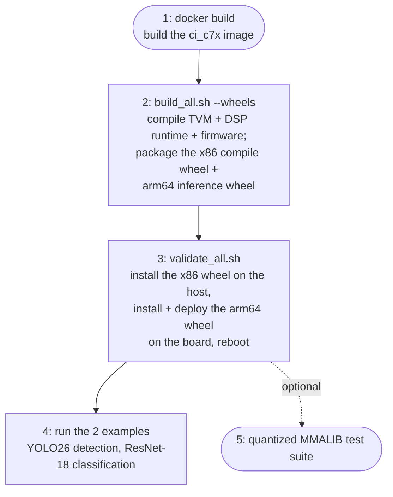

# Getting Started

## Overview

Getting a model running on a real BeagleY-AI board is five steps, but
only three commands -- `validate_all.sh` bundles the deploy, the two
runnable examples, and an optional hardware test suite into one
invocation:



1. **Build the image** -- `docker build ... -f docker/Dockerfile.ci_c7x`
   bakes in the TI CGT C7000 compiler, PSDK RTOS, and the aarch64
   cross-compiler, so none of that needs installing on the host.
2. **Build the wheels** -- `build_all.sh --board beagley-ai --wheels`
   compiles TVM core, the DSP runtime, firmware, and the ARM client,
   then packages two wheels: `tvm-ti-c7x-compile` (x86, compiles and
   quantizes models on the dev host) and `tvm-ti-c7x-inference`
   (arm64, deployed to the board).
3. **Deploy** -- `validate_all.sh --board beagley-ai` installs the x86
   wheel into the host/container venv, then installs the arm64 wheel
   directly on the board and runs its bundled
   `python3 -m tvm.data.ti_dsp.deploy` helper, which copies the
   wheel's bundled firmware image, ARM CLI, and runtime library onto
   the board and reboots so remoteproc autostart picks up the new
   firmware.
4. **Run the 2 examples** -- the same `validate_all.sh` invocation then
   runs `run_yolo26_detection.py` and `run_resnet18_classification.py`
   end to end (quantize, compile, deploy, infer) against the board.
5. **Optional: quantized MMALIB test suite** -- `validate_all.sh` also
   runs the quantized MMALIB pytest suite against real hardware; this
   is supplementary regression coverage, not required to get a model
   running.

`--x86-wheel <path>` / `--arm64-wheel <path>` on `validate_all.sh`
each accept an exact `.whl` file or a directory to glob, so a wheel
pair you didn't build locally -- e.g. downloaded from the
`c7x-build-wheels.yml` GitHub Actions nightly artifact -- can be
deployed and validated against real hardware without a local
`build_all.sh` run first.

## Docker (recommended self-contained build environment)

`docker/Dockerfile.ci_c7x` bakes in everything needed to build for
BeagleY-AI -- the TI CGT C7000 compiler, TI SysConfig, PSDK RTOS, LLVM,
the aarch64 cross-compiler, and `uv` -- so none of that needs installing
on the host directly. This is the fastest path from a clean checkout to
a validated board; three commands:

```bash
# 1. Build the image (behind a corporate proxy: pass it through as
#    shown; otherwise drop the --build-arg lines)
docker build -t tvm.ci_c7x:latest \
  --build-arg http_proxy=$http_proxy \
  --build-arg https_proxy=$https_proxy \
  -f docker/Dockerfile.ci_c7x docker/

# 2. Build TVM + DSP runtime + firmware + ARM client + packaging
#    wheels for BeagleY-AI
docker/bash.sh tvm.ci_c7x -- \
    bash src/runtime/ti_dsp/build_all.sh --board beagley-ai --wheels

# 3. Deploy firmware and hardware-validate on a BeagleY-AI board,
#    installing and testing the wheel from step 2 (not this checkout).
#    Needs SSH access to the board and cached torchvision weights; see
#    docker/README_c7x.md for mount/proxy details.
docker/bash.sh --net=host \
    -v ~/.ssh:$(pwd)/.ssh:ro \
    -v ~/.cache/torch:$(pwd)/.cache/torch:ro \
    --env http_proxy=$http_proxy --env https_proxy=$https_proxy \
    tvm.ci_c7x -- \
    bash src/runtime/ti_dsp/validate_all.sh --board beagley-ai
```

`docker/bash.sh` bind-mounts this repo into the container and runs as
your host user, so all output -- builds, wheels, the `.venv-ci-c7x` test
venv -- lands in this same working tree, owned by you; nothing is
copied into or built inside the image itself. Scoped to BeagleY-AI only
today.

See `docker/README_c7x.md` in the source tree for the SSH/torch cache
mount details, why `PYTHONPATH` gets explicitly unset before testing,
and how this wires into Jenkins.

## Confirming the Board Is Alive

`validate_all.sh` already health-checks the board itself (step 3 above),
but to check by hand after any deploy -- `validate_all.sh`, or a manual
`deploy-c7x.sh`/`arm/build.sh deploy` -- confirm the firmware actually
came up before running a model:

```bash
ssh root@beagley-ai c7x_compute ping   # or: status
```

For the firmware's own hardware regression suite and a C++ API smoke
test against live firmware, see [Verifying Your
Deployment](../contributor-guide/testing/verifying-deployment.md) in the
contributor guide.

## Compile and Run a Model

For full runnable examples of both offload APIs -- YOLO26 object
detection via the Python API (with optional MMALIB offload visualization
and per-layer cycle profiling), and ResNet-18 classification via the C++
API -- quantizing, compiling, deploying, and running end-to-end on a real
BeagleY-AI/AM67A board, see [Examples: YOLO26 & ResNet-18](examples.md).
See `tests/ti-dsp-runtime/dsp-cpp/dsp_utils.py` in the source tree for
the lower-level build and deploy pipeline used by all pytest tests.

See [Deploying Firmware](deploying-firmware.md) for building/deploying
`libc7x_arm_runtime.so` and the firmware itself, including
troubleshooting and recovery procedures.

## MMALIB Offloading

For ops in MMALIB's supported set, `-mmalib=1` routes them directly to
TI's MMALIB library, which programs the C7x MMA coprocessor via a
`call_extern` from the single generated `lib0.c` to an MMALIB wrapper,
with quantization scale/shift/bias folded in at compile time:

```
target = "c_static -mcpu=c7x -mmalib=1"
```

A single 64ch 56×56 int8 conv2d layer takes ~45M cycles as C7x
code; the same layer takes ~1.67M cycles via the MMA coprocessor (27x),
dropping to ~477K cycles (96x) when input data is staged into L2 SRAM
via DMA before the MMA call.

This offload only applies to ops that were quantized to int8/int16 in the
first place -- see [Quantization](quantization.md) for how models in this
repo get there (PT2E + `C7xMMAQuantizer`) and how to confirm a given op
actually reached MMALIB rather than falling through to scalar loop
codegen. See [Compilation](compilation.md) for the `relax.build` /
`export_library` / DLOAD-build sequence that turns this target string
into a runnable module.

```bash
# Quick MMALIB kernel unit tests, host emulation
pytest --rootdir=tests/ti-dsp-runtime tests/ti-dsp-runtime/mmalib-tests/ -m quick --dsp-mode=c7x_host -v

# Full quantized model with MMALIB (AM67A hardware)
pytest --rootdir=tests/ti-dsp-runtime tests/ti-dsp-runtime/dsp-tests/test_quantized_resnet_dsp.py \
    -v --dsp-mode=c7x_dload --use-cpp-api --mmalib --profile
```

See [MMALIB Integration](../contributor-guide/backend/mmalib-integration.md)
for the full QDQ fusion pipeline, supported-op constraints, per-model
performance, and the firmware/codegen build flags that scope
BeagleY-AI to MMALIB alone.
